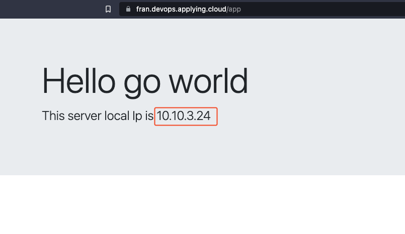

# Go demo for ECS containers 

## Description

This is a simple project written in Go that will get the `ECS Task IP address` and will show it to you on the browser.

## Getting Started

### Dependencies

- Go version 1.18+
- Only works on ECS task

### Installing

- Clone the repo: `git clone https://github.com/FranP0610/go-app-cicd.git`
- Navigate into the cloned project: `cd <repo-name>`

### Executing program
- This project uses a GitHub Actions pipeline to build and deploy the docker image into an existing ecs service.
  - If you want to use it you must set up the following resources:
    1. **GitHub Actions**: This project uses gitHub actions pipelines. You can find the instructions needed for the connection [here](https://aws.amazon.com/blogs/security/use-iam-roles-to-connect-github-actions-to-actions-in-aws/)
    2. **Create the ECS Cluster**
    3. **Create the Application Load Balancer**
    4. **Create the ECS Service**

## Contributing

Pull requests are welcome. For major changes, please open an issue first to discuss what you would like to change.

## License

This project is licensed under the [MIT License](LICENSE).

## Authors

- Your name [@FranP0610](https://github.com/FranP0610)

## Version History

- 0.1
    - Initial Release
